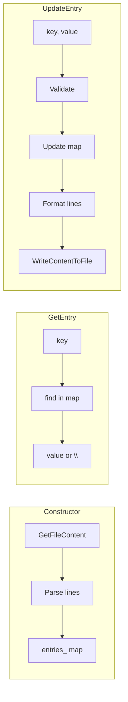

# ConfigurationFile class design

## Summary

- **Header:** [code/utils/configuration_file.h](code/utils/configuration_file.h) (new)
- **Implementation:** [code/utils/configuration_file.cc](code/utils/configuration_file.cc) (new)
- **Dependencies:** [code/utils/file_utils.h](code/utils/file_utils.h) for `FileManager` (forward-decl in .h), `GetFileContent`, `WriteContentToFile`
- **Build:** Add both files to [code/utils/CMakeLists.txt](code/utils/CMakeLists.txt) in the Utils library

## File format and constraints

- **One line per entry.** Format: `key value` — first space separates key from value; the rest of the line is the value (so values may contain spaces).
- **Constraints:** Keys must not contain space or newline; values must not contain newline. Enforce these in `UpdateEntry` (reject invalid input, e.g. throw or no-op); when reading, skip or reject malformed lines.
- **Missing file:** If the path does not exist at construction time, treat as empty dictionary (same as [GetFileContent](code/utils/file_utils.cc) returning `""`).

## Class design

- **Lifetime:** Non-owning `FileManager*` and path; caller must keep `FileManager` alive.
- **Storage:** `std::map<std::string, std::string> entries_`; path and `FileManager*` as member data.
- **Constructor:** `ConfigurationFile(FileManager* fm, std::string path)`  
  - Call `GetFileContent(fm, path)`. If non-empty, split into lines (e.g. by `\n`), then for each line split on the first space: substring before first space = key, rest = value. Insert into `entries_`. Skip empty lines; optionally skip lines with invalid key (e.g. contains space/newline).
- **GetEntry(key):** Return value for `key` if present, otherwise `""`. Use `map::find` (do not use `operator[]`, which would insert).
- **UpdateEntry(key, value):** Validate key (no space, no `\n`) and value (no `\n`). If invalid, throw (e.g. `SimpleException`) or document no-op. Update `entries_[key] = value`, then serialize: for each entry write `key + " " + value + "\n"`, and call `WriteContentToFile(fm, path, content)`.

## Style and conventions (from [docs/how_to_code.md](docs/how_to_code.md))

- Class/function names: CamelCase; member variables: snake_case with trailing underscore; public first, private last.
- Header: forward-declare `FileManager`; no full include needed for pointer. Include `<map>`, `<string>`.
- Implementation in .cc (non-template, multi-line). Include `configuration_file.h`, `file_utils.h`, and `exception.h` (if throwing). Use anonymous namespace for any line-parsing helpers.
- No public member variables; no raw new/delete.

## Tests (required)

Add [code/utils/configuration_file_test.cc](code/utils/configuration_file_test.cc) and a dedicated test target in [code/utils/CMakeLists.txt](code/utils/CMakeLists.txt) (same pattern as `file_utils_test`), using `InMemoryFileManager` to avoid real disk I/O. Use Catch2 and tags e.g. `[configuration_file]`.

**Thorough test cases:**

1. **Missing file** — Path does not exist at construction: config is empty; `GetEntry("any")` returns `""`.
2. **Empty file** — File exists but content is `""`: config is empty; `GetEntry("any")` returns `""`.
3. **Single entry** — Pre-write content `"key value\n"`, construct, then `GetEntry("key")` returns `"value"`.
4. **Multiple entries** — Pre-write `"a 1\nb 2\nc 3\n"`, construct; `GetEntry("a")`/`"b"`/`"c"` return `"1"`/`"2"`/`"3"`.
5. **Value with spaces** — Line `"k v1 v2 v3"`: after first space the rest is value; `GetEntry("k")` returns `"v1 v2 v3"`.
6. **Empty lines** — Content with `"\n\nkey val\n\n"`: empty lines skipped; `GetEntry("key")` returns `"val"`.
7. **Key-only line** — Line with no space (e.g. `"keyonly"`): value is `""`; `GetEntry("keyonly")` returns `""`.
8. **Missing key** — For any loaded config, `GetEntry("nonexistent")` returns `""`.
9. **UpdateEntry then GetEntry** — Construct with empty/missing file; `UpdateEntry("x", "y")` then `GetEntry("x")` returns `"y"`.
10. **UpdateEntry persists to file** — After `UpdateEntry("a", "b")`, read file via `GetFileContent(fm, path)` and assert content contains the line `"a b\n"` (or equivalent).
11. **UpdateEntry overwrites** — Pre-write `"k old\n"`, construct, `UpdateEntry("k", "new")`; `GetEntry("k")` is `"new"` and file content reflects it.
12. **Round-trip** — Pre-write `"p q\n"`, construct Config A, `GetEntry("p")` == `"q"`; call `UpdateEntry("p", "r")`; construct Config B from same path (same InMemoryFileManager), `GetEntry("p")` == `"r"`.
13. **Invalid key: space** — `UpdateEntry("key with space", "v")` throws (e.g. `SimpleException`).
14. **Invalid key: newline** — `UpdateEntry("key\n", "v")` throws.
15. **Invalid value: newline** — `UpdateEntry("k", "v\n")` throws.
16. **Duplicate keys in file** — If file has `"k v1\nk v2\n"`, define and test behavior (e.g. last wins).

## Build integration

- In [code/utils/CMakeLists.txt](code/utils/CMakeLists.txt): add `configuration_file.h` and `configuration_file.cc` to the `add_library(Utils ...)` list; add the `configuration_file_test` executable (link Utils and Catch2) and `add_test(NAME configuration_file_test ...)`.

## Data flow (high level)

No other files need to change unless you add a dedicated test target for ConfigurationFile.
