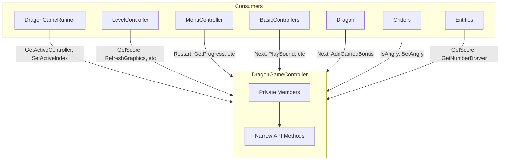

# Cursor: DragonGameController Public Variable Burndown Plan

Apply [public_variable_burndown.md](docs/public_variable_burndown.md) to `DragonGameController`: no public member variables; all access via functions with a narrow API (read-only when possible, forwarding instead of getters when only one operation is needed).

## Source Files

- **Header:** [code/game/controller/dragon_game_controller.h](code/game/controller/dragon_game_controller.h) — move members to private, add accessors
- **Implementation:** [code/game/controller/dragon_game_controller.cc](code/game/controller/dragon_game_controller.cc) — update internal uses
- **Call sites:** [dragon_game_controller_public_access.md](docs/dragon_game_controller_public_access.md) lists all consumers

## Access Pattern Summary (from docs)

| Member                                                                   | Consumers                                                               | Access                                  | Narrow API                                                                                         |
| ------------------------------------------------------------------------ | ----------------------------------------------------------------------- | --------------------------------------- | -------------------------------------------------------------------------------------------------- |
| vCnt, nActive                                                            | DragonGameRunner, LevelController, MenuController                       | read/write, delegate                    | `GetActiveController()`, `GetControllerCount()`, `SetActiveIndex()`, `GetControllerAt(i)`          |
| vLevelPointers                                                           | MenuController                                                          | read .at(0/1/2)                         | `GetLevelIndexForChapter(int)`                                                                     |
| pGraph                                                                   | EntityListController, LevelController, MenuController, BuyNowController | RefreshAll, DrawRectangle, DrawCursor   | `RefreshGraphics()`, `DrawRectangle(...)`, `DrawCursor(mc)`                                        |
| pDr                                                                      | MenuController, EntityListController, BuyNowController                  | pass to Draw, read nFactor              | `GetDrawer()` (needed for Draw) or `GetScaleFactor()`                                              |
| pNum, pBigNum, pFancyNum                                                 | Many controllers, entities                                              | Draw calls, pass to constructors        | `GetNumberDrawer()`, `GetBigNumberDrawer()`, `GetFancyNum()` — or forward specific Draw calls      |
| pSnd                                                                     | Many                                                                    | PlaySound, Toggle, Get                  | `PlaySound(idx)`, `ToggleSound()`, `GetSoundOn()`                                                  |
| nScore, nHighScore                                                       | Simulation, LevelController, Entities, DragonScoreController            | read/write                              | `GetScore()`, `SetScore()`, `AddScore(n)`, `GetHighScore()`, `SetHighScore(n)`                     |
| bAngry                                                                   | Critters, CritterGenerators                                             | write true, read                        | `SetAngry()`, `IsAngry()`                                                                          |
| snProgress, sbSoundOn, sbMusicOn, sbTutorialOn, sbFullScreen, sbCheatsOn | MenuController, LevelController, basic_controllers                      | Get/Set/Toggle                          | `GetProgress()`, `GetSoundOn()`, `SetSoundOn()`, etc.                                              |
| rBound                                                                   | LevelController                                                         | read sz                                 | `GetBounds()` or `GetBoundsSize()`                                                                 |
| plr                                                                      | MenuController, SoundControls                                           | ToggleOff, bOff, SwitchTheme, StopMusic | `GetMusicPlayer()` or forward: `ToggleMusicOff()`, `IsMusicOff()`, `SwitchTheme(n)`, `StopMusic()` |
| lsBonusesToCarryOver                                                     | Dragon, LevelController                                                 | push_back, clear, iterate               | `AddCarriedBonus()`, `ClearCarriedBonuses()`, `ForEachCarriedBonus(callback)` or iterators         |
| pWrp                                                                     | MenuController, LevelController, DragonScoreController                  | pExitProgram, szActualRez, GetFilePath  | `TriggerExit()`, `GetActualResolution()`, `GetFilePath()`                                          |

## Implementation Strategy

### Phase 1: Controller stack (vCnt, nActive)

- Add: `unsigned GetControllerCount()`, `GameController* GetActiveController()`, `void SetActiveIndex(unsigned)`, `unsigned GetActiveIndex()`
- DragonGameRunner: replace `vCnt[nActive]->Update()` with `GetActiveController()->Update()`, etc.
- LevelController: replace `pGl->vCnt.size() - 2` with `GetControllerCount() - 2`, `pGl->nActive = ...` with `SetActiveIndex(...)`
- MenuController: replace `pGl->nActive = nResumePosition` with `SetActiveIndex(nResumePosition)`

### Phase 2: Level pointers and Restart

- Add: `int GetLevelIndexForChapter(unsigned chapter)` returning `vLevelPointers.at(chapter)`
- MenuController: replace `Restart(vLevelPointers.at(0))` with `Restart(GetLevelIndexForChapter(0))`

### Phase 3: Graphics (pGraph, pDr, pNum, pBigNum, pFancyNum)

- **pGraph:** Add `void RefreshGraphics()`, `void DrawRectangle(Rectangle, Color, bool)`. For `MouseCursor::DrawCursor(pGraph)` — either add `void DrawCursor(MouseCursor&)` or keep a narrow getter for the GI pointer used only for cursor drawing.
- **pDr:** Add `smart_pointer<ScalingDrawer> GetDrawer()` (needed to pass to `Draw()` and for `nFactor`). Per burndown, if only one use: EntityListController reads `nFactor` — add `unsigned GetScaleFactor()` and pass `GetDrawer()` where Draw is needed.
- **pNum, pBigNum, pFancyNum:** Add `GetNumberDrawer()`, `GetBigNumberDrawer()`, `FontWriter* GetFancyNum()` — these are passed to entity constructors and used for multiple Draw calls, so getters are appropriate.

### Phase 4: Sound (pSnd)

- Add `void PlaySound(Index idx)`, `void ToggleSound()`, `bool GetSoundOn()` — narrow API. Callers using `pSnd->PlaySound(GetSnd(key))` become `PlaySound(GetSnd(key))` (forwarding).

### Phase 5: Score and high score

- Add `int GetScore()`, `void SetScore(int)`, `void AddScore(int)`, `int GetHighScore()`, `void SetHighScore(int)`

### Phase 6: Angry flag

- Add `void SetAngry()`, `bool IsAngry()` (only ever set to true, so no `SetAngry(bool)`)

### Phase 7: Savable variables

- Add getters/setters/toggles per variable:
  - `int GetProgress()`, `void SetProgress(int)` if needed (menu only reads)
  - `bool GetSoundOn()`, `void SetSoundOn(bool)`
  - `bool GetMusicOn()`, `void SetMusicOn(bool)`
  - `bool GetTutorialOn()`, `void ToggleTutorial()`, `const bool* GetTutorialOnPointer()` for entity
  - `bool GetFullScreen()`, `void ToggleFullScreen()`
  - `bool GetCheatsOn()`, `void ToggleCheats()`

### Phase 8: Bounds, music player, bonuses, wrapper

- **rBound:** `Rectangle GetBounds()` or `Size GetBoundsSize()`
- **plr:** Add `void ToggleMusicOff()`, `bool IsMusicOff()`, and either `BackgroundMusicPlayer& GetMusicPlayer()` for SoundControls (needs SwitchTheme/StopMusic) or forward those
- **lsBonusesToCarryOver:** `void AddCarriedBonus(smart_pointer<TimedFireballBonus>)`, `void ClearCarriedBonuses()`, and for Dragon iteration: `void ForEachCarriedBonus(std::function<void(TimedFireballBonus&)>)` or expose `begin()/end()` via a small wrapper
- **pWrp:** `void TriggerExit()`, `Size GetActualResolution()`, `FilePath* GetFilePath()`

### Phase 9: Internal-only members

- **pMenu, pSndRaw, vLvl, sbCheatsUnlocked, pSelf:** Move to private; no new accessors (only used inside DragonGameController)

## Files to Modify

1. **[dragon_game_controller.h](code/game/controller/dragon_game_controller.h)** — Declare all members private; add ~25–30 accessor methods
2. **[dragon_game_controller.cc](code/game/controller/dragon_game_controller.cc)** — Update internal references to use new accessors where needed
3. **[dragon_game_runner.cc](code/game/dragon_game_runner.cc)** — vCnt, nActive
4. **[level_controller.cc](code/game/controller/level_controller.cc)** — pGraph, pNum, pBigNum, pSnd, rBound, sbMusicOn, sbTutorialOn, sbCheatsOn, lsBonusesToCarryOver, pWrp, vCnt, nActive
5. **[menu_controller.cc](code/game/controller/menu_controller.cc)** — nActive, vLevelPointers, pGraph, pDr, pNum, pSnd, snProgress, sbSoundOn, sbMusicOn, sbTutorialOn, sbFullScreen, sbCheatsOn, plr, pWrp
6. **[basic_controllers.cc](code/game/controller/basic_controllers.cc)** — pGraph, pDr, pSnd, nScore, nHighScore, sbCheatsOn, pWrp
7. **[buy_now_controller.cc](code/game/controller/buy_now_controller.cc)** — pGraph, pDr, GetImgSeq
8. **[dragon.cc](code/game/dragon.cc)** — pSnd, lsBonusesToCarryOver, Next, GetImgSeq, GetSnd
9. **[critters.cc](code/game/critters.cc)** — pNum, pSnd, bAngry, GetImgSeq, GetSnd
10. **[critter_generators.cc](code/game/critter_generators.cc)** — pSnd, nHighScore, bAngry, GetImgSeq, GetSnd
11. **[fireball.cc](code/game/fireball.cc)** — pNum, pSnd, GetImg, GetImgSeq, GetSnd
12. **[entities.cc](code/game/entities.cc)** — pNum, pBigNum, pFancyNum, nScore, nHighScore, plr
13. **[level.cc](code/game/level.cc)** — GetImg
14. **[simulation.cc](code/simulation/simulation.cc)** — nScore, nHighScore (via GetTowerController)

## Verification

- Build: `cd build; cmake ../code -G "MinGW Makefiles"; mingw32-make`
- Tests: `cd build; ctest --output-on-failure`
- Simulation: `cd bin; .\simulation_test.exe`

## Diagram: Access Flow After Refactor

