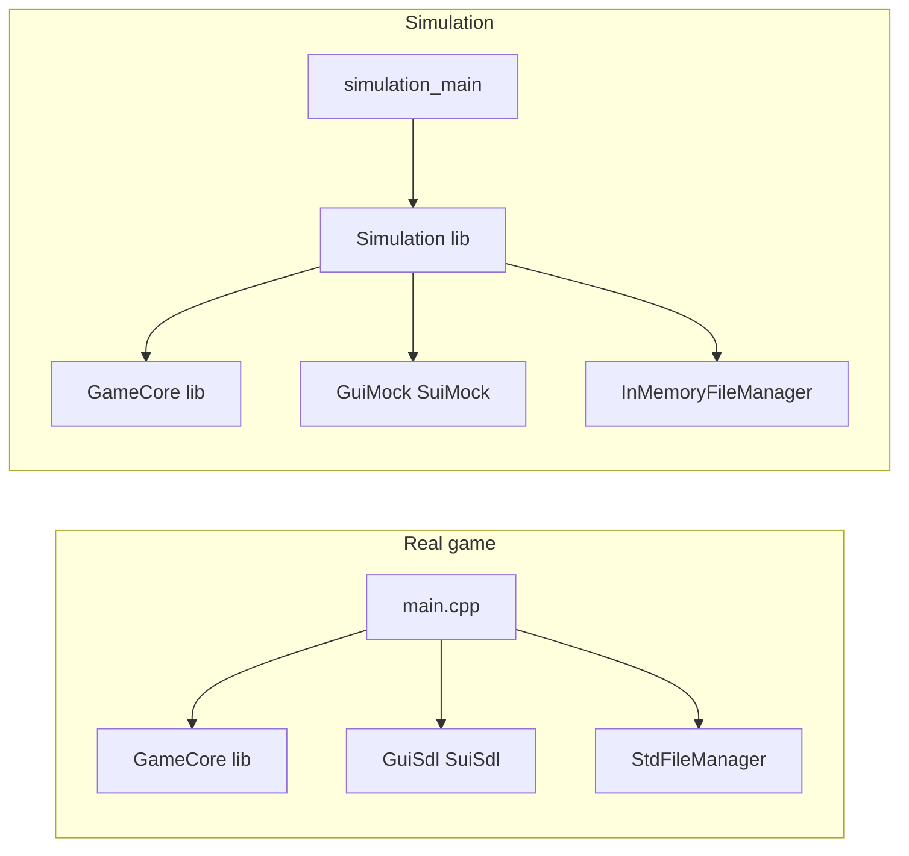

# Game logic simulator

## Goal

Run the same controller/game logic as [game/main.cpp](game/main.cpp) without SDL or display: initialize **ProgramEngine** and **GlobalController** with **GuiMock**, **SuiMock**, and **InMemoryFileManager**, then advance frames in a loop. All simulation code under **simulation/**; follow [how_to_code.md](how_to_code.md). First pass: simple simulation with minimal/no user input (no key injection).

## Architecture

- **Current**: [game/CMakeLists.txt](game/CMakeLists.txt) builds a single executable `tower_defense` (main.cpp + all game .cpp). No shared library.
- **Target**: (1) **ProgramEngine** always receives a **FileManager*** (caller-owned). main.cpp creates **StdFileManager** and passes its pointer. (2) Game logic built as a **static library** so both the real game and the simulator can link it. (3) Simulator: normal binary (not a test) — **Simulation** library (simulation.h / simulation.cpp) + **simulation_main.cpp**; uses mocks and InMemoryFileManager, runs frame loop with no key input for the first pass.




## 1. Create implementation summary document

Create the implementation summary doc first (per [how_to_plan.md](how_to_plan.md)). Name it the same as this plan with a `_implementation_summary` suffix (e.g. `game_logic_simulator_implementation_summary.md`). Place it next to the plan (e.g. `.cursor/plans/`). Leave space to fill in for each step: deviations from plan, issues, solutions, tips for the future. After finishing all implementation steps, add a short summary section at the top consolidating deviations, issues, solutions, and tips.

**Update implementation summary:** note that the doc was created (no deviations/issues yet).

## 2. ProgramEngine always requires FileManager* (caller-owned)

No optional arguments: **ProgramEngine** constructors always take a `Gui::FileManager*`; the caller owns it and keeps it alive.

- **[game_utils/Global.h](game_utils/Global.h)**: Add `FileManager*` member and getter to **ProgramEngine**. Update both constructors to take `FileManager* p_fm` as last parameter.
- **[game/game.h](game/game.h)**: **TowerDataWrap** — remove `std::unique_ptr<FileManager> fm_`, add `FileManager* p_fm_` (from `pe.GetFileManager()`). Keep `std::unique_ptr<FilePath> fp_`.
- **[game/core.cpp](game/core.cpp)**: **TowerDataWrap(ProgramEngine pe)** — set `p_fm_ = pe.GetFileManager()`, use `p_fm_->ReadFile("config.txt")` and `FilePath::CreateFromStream(..., p_fm_)`. Remove StdFileManager creation.
- **[game/main.cpp](game/main.cpp)**: Create `std::unique_ptr<Gui::FileManager> fm(new Gui::StdFileManager())` that outlives the run; pass `fm.get()` to **ProgramEngine** (last argument).

**Update implementation summary:** deviations, issues, solutions, tips (if any).

## 3. Refactor game into a library

- In [game/CMakeLists.txt](game/CMakeLists.txt):
  - Add a static library target (e.g. **GameCore**) with all game .cpp **except** `main.cpp`.
  - Keep **tower_defense** as an executable that compiles only `main.cpp` and links **GameCore** plus GuiSdl, SuiSdl, GameUtils, etc.
- Ensure GameCore’s `target_include_directories` and `target_link_libraries` are set so that tower_defense and the simulator can both depend on it (game, game_utils, utils, wrappers; no SDL in GameCore).

**Update implementation summary:** deviations, issues, solutions, tips (if any).

## 4. Simulation directory (library + main binary, no test)

Simulation is a normal binary, not a Catch2 test. Structure: simulation.h / simulation.cpp (Simulation library) and simulation_main.cpp (executable). First pass: init and run N frames, no key input.

- **simulation/CMakeLists.txt**: Add library **Simulation** (simulation.cpp), link GameCore, GuiMock, SuiMock, Utils, GameUtils. Add executable **simulation_main** (simulation_main.cpp), link Simulation. No add_test.
- **simulation/simulation.h**: Declare entry point (e.g. void RunSimulation();).
- **simulation/simulation.cpp**: Seed srand; build mocks and SimpleGraphicalInterface/SimpleSoundInterface; build InMemoryFileManager with config.txt, levels file, minimal font file(s); create ProgramEngine (5-arg, with fm pointer), GetGlobalController(pe); loop N frames with pGl->Update() only.
- **simulation/simulation_main.cpp**: main() calls RunSimulation(); return 0;.
- **Root CMakeLists.txt**: add_subdirectory(simulation) after game.

**Update implementation summary:** deviations, issues, solutions, tips (if any).

## 5. Minimal data for InMemoryFileManager

- **config.txt**: `"SYSTEM 0\nPATH .\n"`  
- **Levels**: same name as used in [game/core.cpp](game/core.cpp) for the non-FULL_VERSION build (e.g. `levels_trial.txt`). Provide minimal valid content: at least one `LevelLayout` so `ReadLevels` does not throw (format as in [game/level.cpp](game/level.cpp) `operator>>`).  
- **Font**: `NumberDrawer` and `FontWriter` read from `FilePath` (e.g. `dragonfont\\dragonfont.txt` and related). Add minimal entries so `fp->ReadFile(...)` succeeds (e.g. one-byte font .txt so the parser doesn’t fail). Use the same path/key that `GetRelativePath(sFontPath + sFontName + ".txt")` produces (path style depends on config SYSTEM/PATH).
- **config.txt**: `"SYSTEM 0\nPATH .\n"` (or equivalent so `ParsePosition("SYSTEM", ...)` and `ParseGrabLine("PATH", ...)` succeed).  
- **Levels**: Copy one minimal level from an existing `levels_trial.txt` (or equivalent) into a string and write it to the same filename the game uses when building without FULL_VERSION; ensure at least one `LevelLayout` is parsed so `vLvl.size() > 0`.  
- **Font**: Add the key that corresponds to `fp->GetRelativePath("dragonfont\\dragonfont.txt")` (or `dragonfont/dragonfont.txt` depending on path) with content of at least one character so `NumberDrawer`’s read loop and subsequent use don’t crash. FontWriter may need a similar stub path if used during startup.

**Update implementation summary:** deviations, issues, solutions, tips (if any).

## 6. Build and test

- After implementation: run CMake and build from build (per workspace rules). Run simulation_main to verify; run existing tests to ensure no regressions.
- Add a **summary section at the top** of the implementation summary doc consolidating deviations, issues, solutions, and tips for the future from all steps.

**Update implementation summary:** deviations, issues, solutions, tips (if any).

## Files to add

- simulation/CMakeLists.txt — Simulation library + simulation_main executable.
- simulation/simulation.h — Declare RunSimulation (or equivalent).
- simulation/simulation.cpp — Implement simulation (mocks, InMemoryFileManager, ProgramEngine, frame loop).
- simulation/simulation_main.cpp — main() that calls RunSimulation.

## Files to modify

- game_utils/Global.h — ProgramEngine: add FileManager* and getter; both ctors take FileManager*.
- game/game.h — TowerDataWrap: fm_ replaced by p_fm_ (FileManager*).
- game/core.cpp — TowerDataWrap(pe) uses pe.GetFileManager(); remove StdFileManager creation.
- game/main.cpp — Create StdFileManager, pass pointer to ProgramEngine.
- game/CMakeLists.txt — Add GameCore library; tower_defense links GameCore.
- CMakeLists.txt — add_subdirectory(simulation).

## Notes

- **GetProgramInfo()** is still used by screen_controllers/gameplay; it reads `fullscreen.txt` via `AreWeFullScreen()`. For the simulator, that file is not in InMemoryFileManager; the function returns false on read failure, so behavior remains safe. Resolution for the engine is set via the 5-arg `ProgramEngine` ctor.  
- **Preloader / fonts**: All font and resource paths go through `FilePath`, which uses the injected `FileManager`. So all required files (config, levels, minimal font .txt) must be present in the InMemoryFileManager with the exact keys that `GetRelativePath` + `ReadFile` use (path style from config SYSTEM/PATH).

```

```

